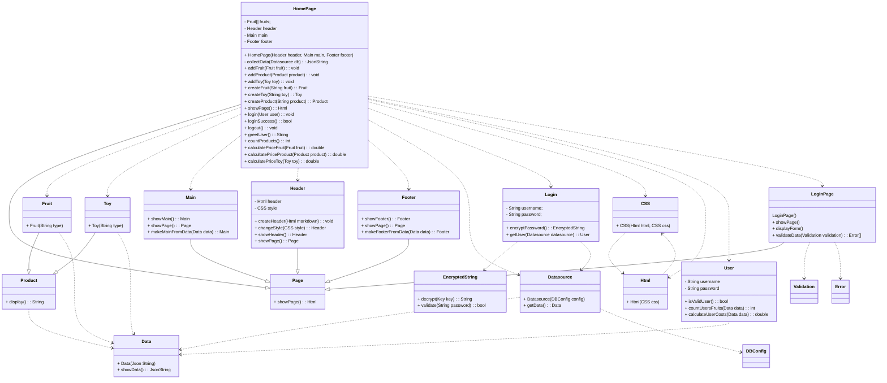

```mermaid
classDiagram

class Page {
    + showPage(): Html
}

class CSS {
    + CSS (Html html, CSS css)
}

class Html {
    + Html (CSS css)
}

class HomePage {
    - Fruit[] fruits;
    + HomePage(Header header, Main main, Footer footer)
    - Header header
    - Main main
    - Footer footer

    - collectData(Datasource db) : JsonString
    + addFruit(Fruit fruit) : void 
    + addProduct(Product product) : void
    + addToy(Toy toy) : void
    + createFruit(String fruit) : Fruit
    + createToy(String toy) : Toy
    + createProduct(String product) : Product
    + showPage() : Html
    + login(User user) : void
    + loginSuccess() : bool
    + logout(): void
    + greetUser(): String
    + countProducts() : int
    + calculatePriceFruit(Fruit fruit) : double
    + calcultatePriceProduct(Product product) : double
    + calculatePriceToy(Toy toy) : double


}

class User {
    - String username
    - String password

    + isValidUser() : bool
    + countUsersFruits(Data data) : int
    + calculateUserCosts(Data data) : double
}

class Product {
    + display() : String
}

class Fruit {
    + Fruit(String type)
}

class Toy {
    + Toy (String type)
}

class Header {
    - Html header
    - CSS style

    + createHeader(Html markdown): void
    + changeStyle(CSS style) : Header
    + showHeader() : Header
    + showPage() : Page
}

class Login {
    - String username;
    - String password;

    + encryptPassword() : EncryptedString
    + getUser(Datasource datasource): User
}

class EncryptedString {
    + decrypt(Key key) : String
    + validate(String password) : bool
}

class Footer {
    + showFooter() : Footer
    + showPage() : Page
    + makeFooterFromData(Data data) : Footer
}

class Main {
    + showMain() : Main
    + showPage() : Page
    + makeMainFromData(Data data) : Main
}

class Datasource {
    + Datasource(DBConfig config)
    + getData() : Data
}

class Data {
    + Data(Json String)
    + showData() : JsonString
}

class LoginPage {
    LoginPage()
    + showPage()
    + displayForm()
    + validateData(Validation validation) : Error<String>[]
}

HomePage --|>  Page
HomePage..>Fruit
HomePage..>Toy
HomePage..>Main
HomePage..>Header
HomePage..>Footer
HomePage..>Datasource
HomePage..>Login
HomePage..>CSS
HomePage..>Html
HomePage..>User
HomePage..>LoginPage
LoginPage --|> Page
Main --|> Page
Footer --|> Page
Header --|> Page
Fruit --|> Product
Toy --|> Product
CSS..>Html
Html..>CSS
Login..>EncryptedString
Datasource..>Data
User..>Data
Fruit..>Data
Product..>Data
Toy..>Data
Login..>Datasource
Datasource..>DBConfig
LoginPage..>Validation
LoginPage..>Error


```